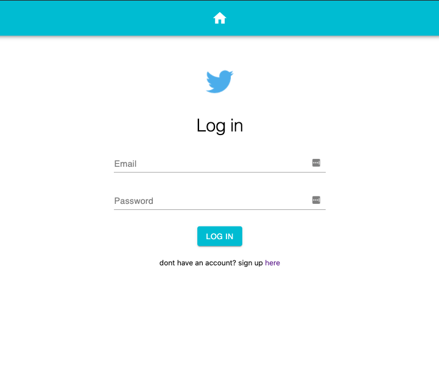
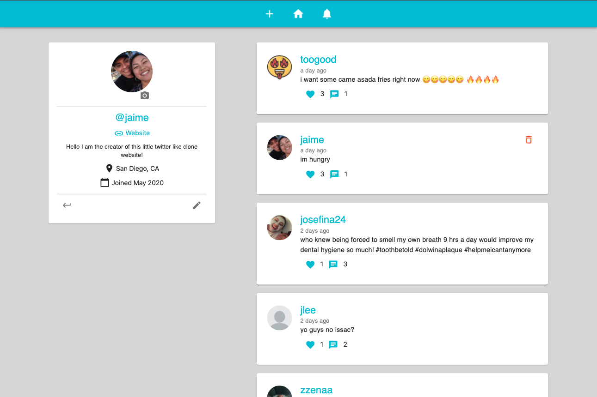
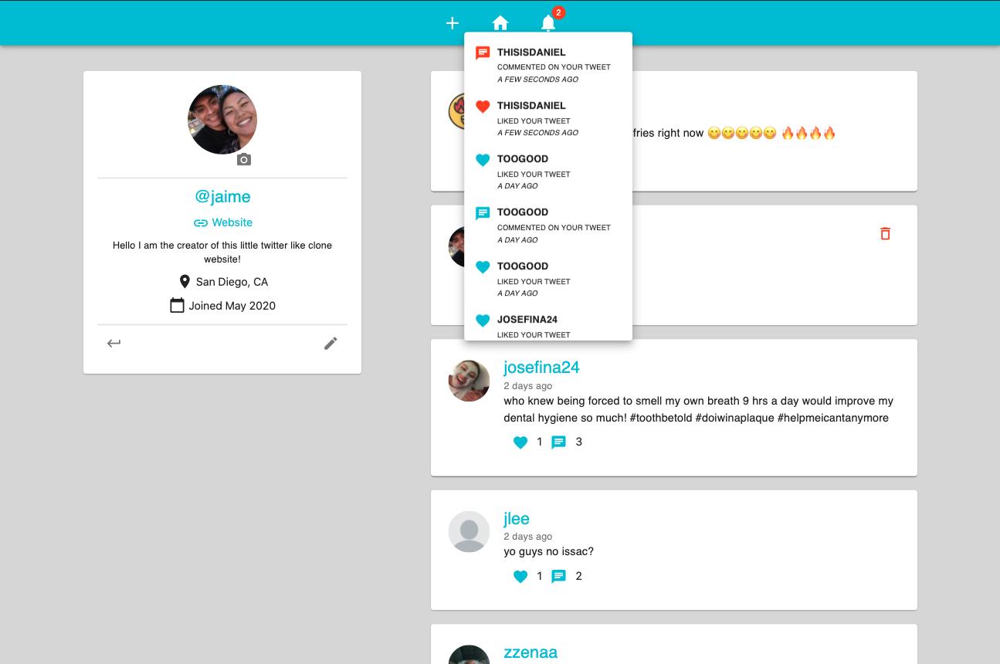
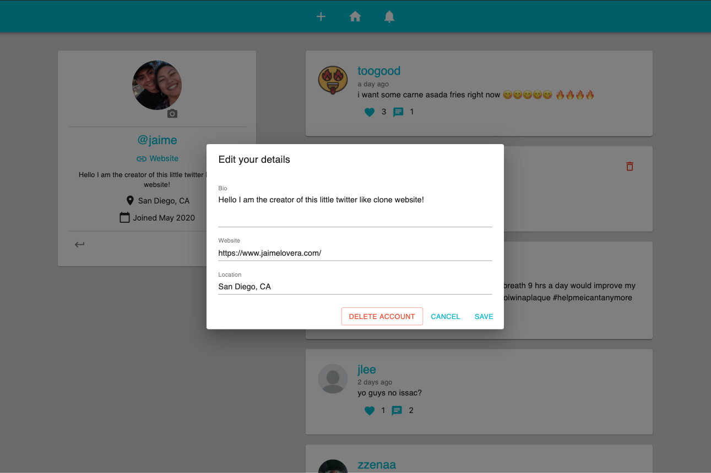
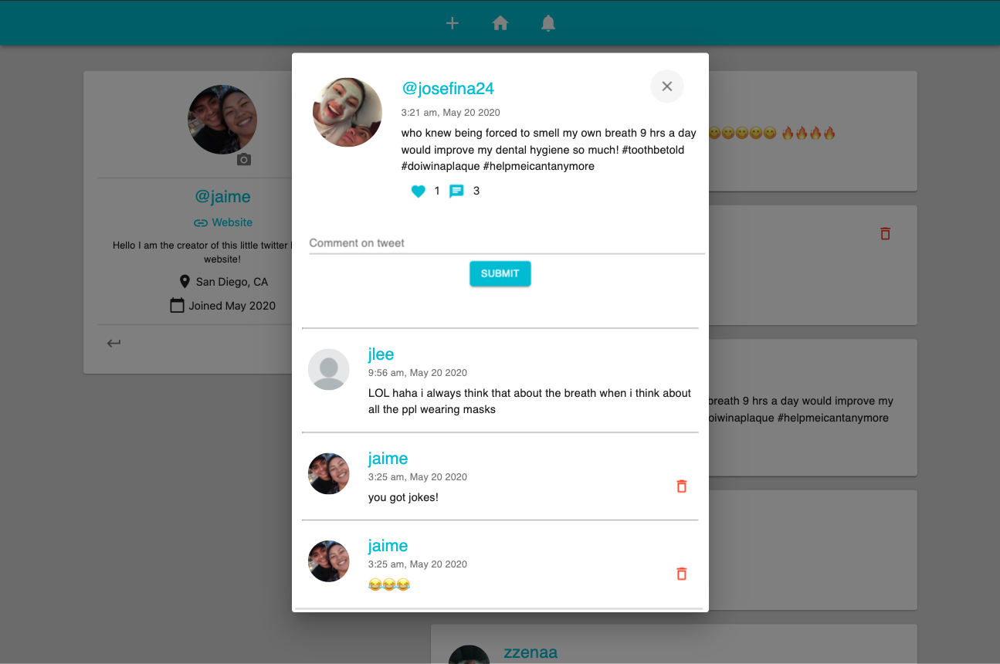
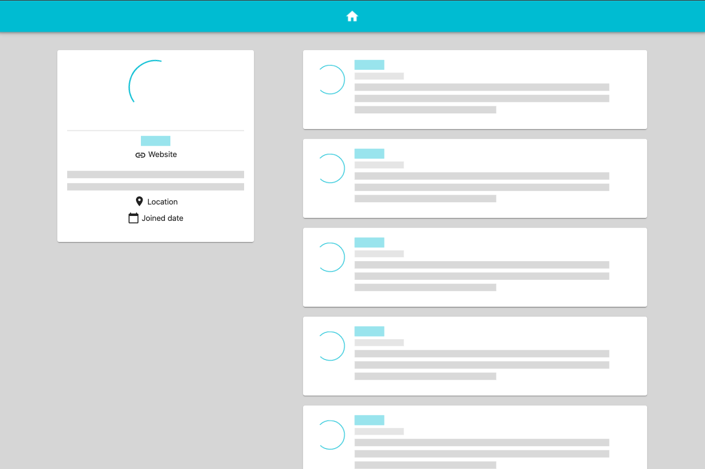
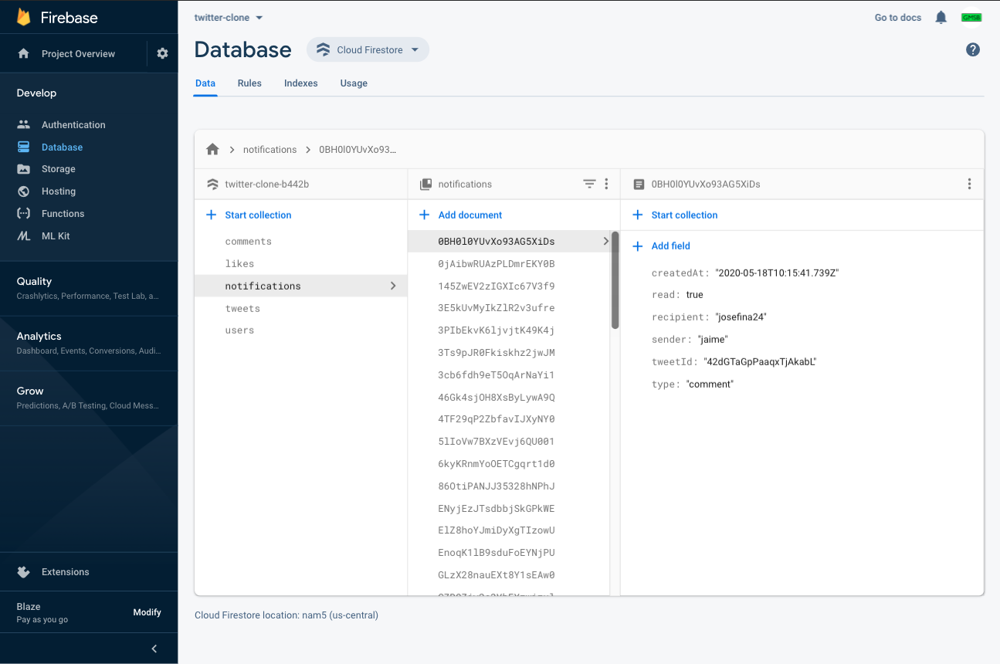

# Twitter Clone - Full Stack Responsive Web App

###### Note: I no longer have the backend services running for this website, so it's not being hosted.

> A full stack project I developed to further build and develop my skillset!  
> Utilized [Firebase](https://firebase.google.com/), [Express](https://expressjs.com/), [React](https://reactjs.org/), [Redux](https://redux.js.org/), and [Material-UI](https://material-ui.com/).

## Key Features

- Desktop and mobile friendly.
- Create a personal account.
- Post tweets, comment on tweets, like tweets.
- Delete tweets, delete comments, unlike tweets.
- Get notifications on all activity.
- Upload a profile picture.
- Add profile details.
- Delete account and all your data.

## Development Process

**Backend:**

- It was really nice using Google's Firebase service to design and build my backend architecture. The real time database allowed me to take more of a test driven approach due to the ability of seeing changes made almost instantly in real time.
- I utilized [Postman](https://www.postman.com/) to help test my API as I was developing it. It is a awesome tool!
- Firebase is written in Node.js, so I was able to leverage Express.js to make my code easier to manage, and to group all my cloud functions into a single /api endpoint.
- In a attempt to create a scaleable application, I split the users data into multiple collections (tables) so that when I need to make a request to the server, I can target a more specific location, vs having to request an entire users data even if only a subset of it is needed (the firebase team has a great [youtube channel](https://youtu.be/haMOUb3KVSo) where they talk about things to consider when designing your database).
- In addition to basic API functions to retrieve, delete, and write data, I created a function that gets trigged when a user account is deleted. When an account is deleted, this trigger will delete all of the users data, and update other data points accordingly (i.e. like/comment counts).

**Frontend:**

- I really like React, and I am continuing to use it. I thought about using the React Context API to help manage my global state as I thought it was sufficient for the requirements of this project, but I decided to use Redux for this project to learn more about it. I think Reacts Context API would have been easier to use in this application, but for the cause of learning, I went with Redux.
- In previous projects, I have stuck to pure CSS for styling. This time I decided to use a UI framework. I chose Material-UI, a popular React UI framework with a large community of developers. This framework takes advantage off CSS grid layout which I love using.
- To help my development process, I utilized two awesome google chrome extensions ([React Developer Tools](https://chrome.google.com/webstore/detail/react-developer-tools/fmkadmapgofadopljbjfkapdkoienihi?hl=en), [Redux DevTools](https://chrome.google.com/webstore/detail/redux-devtools/lmhkpmbekcpmknklioeibfkpmmfibljd?hl=en)) to help me test and pinpoint bugs within my applications global and component level state.
- I used a npm package, [browser-image-compression](https://www.npmjs.com/package/browser-image-compression), to compress the profile images on the client side before they are uploaded to my database to help keep my resources low. I am relying on CSS's object-fit property to help me center the profile images without causing distortion. This works but a better solution would be to allow the user to crop their image before they upload it, but I did not get to implementing this.

## Screenshots

#### Log in

#### Homepage

#### Receive And View Notifications

#### Edit User Details And Delete Account

#### Tweet Dialog

#### Loading Skeleton

#### Database

## App Info

#### Author: [Jaime Lovera](https://github.com/jaimelovera)
